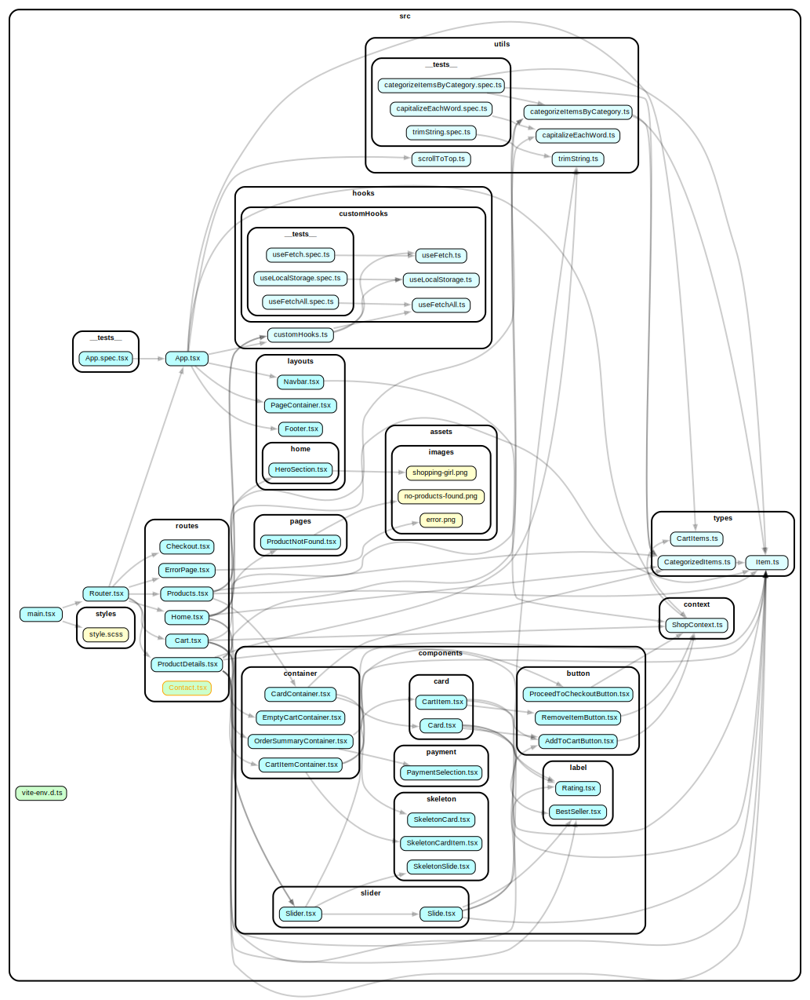

# CraftHaven - Your Online Shopping Destination

#### Visit CraftHaven: [CraftHaven Online Store](https://crafthaven.netlify.app/)


## Description

CraftHaven is your one-stop online shopping destination, offering a wide range of high-quality products from various categories. From fashion and electronics to home decor and more, we have something for everyone.

## Features

-   **Extensive Product Selection**: Explore a vast collection of products, carefully curated to cater to your diverse needs and preferences.

-   **User-Friendly Interface**: Our intuitive and easy-to-navigate website ensures a seamless shopping experience.

-   **Secure Shopping**: Shop with confidence knowing that your personal and payment information is always safe and secure.

-   **Fast Delivery**: We offer swift and reliable delivery options, so you can enjoy your purchases sooner.

-   **Customer Support**: Our dedicated customer support team is here to assist you with any queries or concerns.

-   **Stay Updated**: Subscribe to our newsletter and stay updated with the latest arrivals, discounts, and promotions.

## Dependency Graph



## Installation

1.  Clone the repository:

    ```bash
    git clone https://github.com/karprabha/shopping-cart
    ```

2.  Navigate to the project directory:

    ```bash
    cd shopping-cart
    ```

3.  Install dependencies:

    ```bash
    npm install
    ```

4.  Start the development server:
    ```bash
    npm start
    ```

## Technologies Used

-   "React"
-   "React Router"
-   "TypeScript"
-   "Vitest"
-   "React Testing Library"
-   "SCSS"
-   "Vite"

## Upcoming Features

I have exciting plans for the future, including:

-   **User Authentication**: Create an account to save your favorite items, track orders, and enjoy a personalized shopping experience.
-   **Secure Payment Options**: Choose from various payment methods, ensuring a secure and convenient checkout process.
-   **Order Tracking**: Keep tabs on your orders and receive real-time updates on their status.
-   **Order History**: Easily access your order history to review past purchases.

## Contributing

We welcome contributions from the community! If you'd like to get involved, please follow our [Contribution Guidelines](./CONTRIBUTING.md) to help us improve CraftHaven.

## Credits

This project wouldn't have been possible without the contributions of various resources and individuals:

-   **Fake Store API**: The product data used in this project is sourced from the [Fake Store API](https://fakestoreapi.com/), allowing us to populate our virtual store with a diverse range of products.

-   **Unsplash**: We're grateful to [Unsplash](https://unsplash.com/) for providing high-quality images, icons, and wallpapers that enhance the visual appeal of our e-commerce platform.

Please note that the resources used in this project are for educational and demonstration purposes only. This project is not intended for commercial use or distribution. We do not intend to sell, profit from, or violate any copyrights or licenses associated with these resources. We sincerely appreciate the contributions of these resources and their creators.

We extend our heartfelt thanks to each of these resources and their creators for enhancing the quality and aesthetics of our CraftHaven e-commerce platform. Your contributions have made this project truly special!
